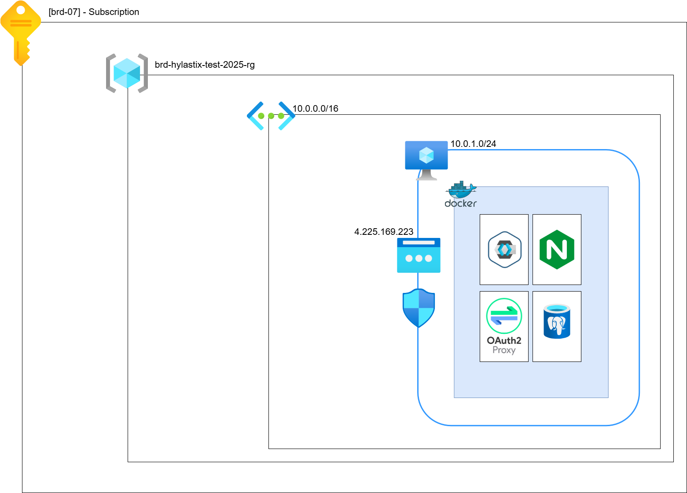
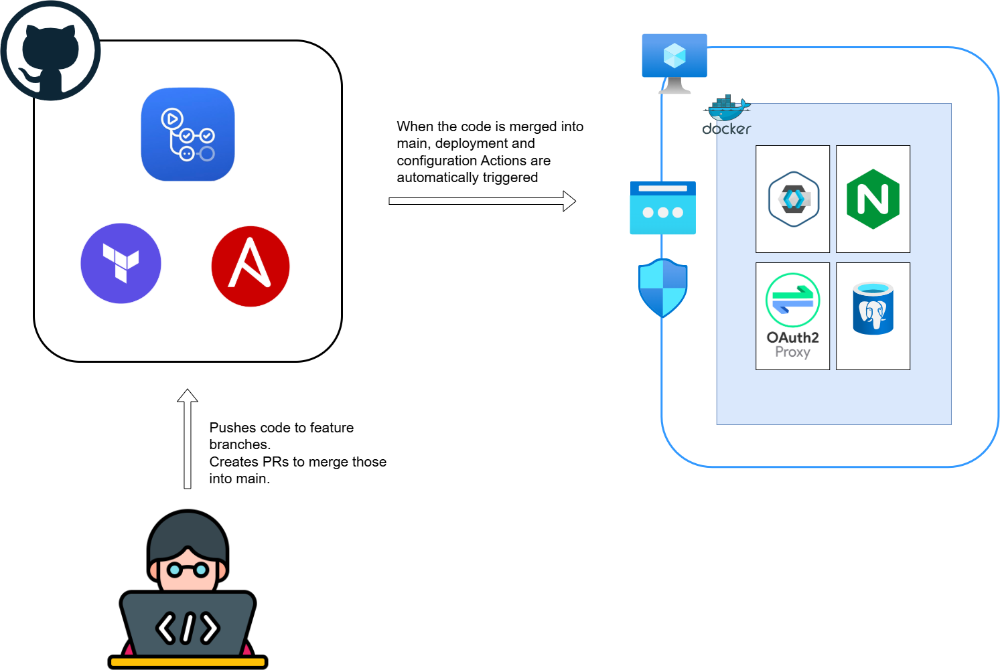

# brd-hylastix-test

## Overview
This project deploys a virtual machine (VM) in Azure with a minimal container environment using Docker. It runs a Keycloak container for authentication, a Postgres database for Keycloak's data, an Nginx web server hosting a static web page secured by Keycloak and Oauth2Proxy container serving as middleware. The infrastructure is provisioned with Terraform, configured with Ansible, and managed via GitHub Actions for deployment and teardown.

## Features
- **Keycloak**: Provides identity and access management for the web application.
- **Postgres**: Stores Keycloak's user and authentication data.
- **Nginx**: Serves a static web page with access controlled by Keycloak.
- **Oauth2Proxy**: Serves as middleware between Nginx and Keycloak.
- **Terraform**: Defines Azure infrastructure (VM, networking, etc.).
- **Ansible**: Configures the VM and deploys containers.
- **GitHub Actions**: Automates deployment, configuration, and teardown.

## Architecture
- **Azure VM**: Hosts the container environment.
- **Docker**: Runs Keycloak, Postgres, and Nginx containers.
- **Networking**:
  - Virtual Network (VNet) with a single subnet.
  - Public IP for VM access.
  - Network Security Group (NSG) allowing port 8080 (Keycloak), 80 (static web page) and 22 (SSH).
- **Keycloak**: Configured to use Postgres as its database and secure the Nginx-hosted static page.
- **Postgres**: Stores Keycloak data with a secure connection.
- **Nginx**: Serves a static HTML page, integrated with Keycloak for authentication.

## Usage
1. Navigate to the web server (e.g., `http://4.225.169.223`).
2. Log in via Keycloak to view the static web page (username: test_user; password: Test123!).

## Justifications
- **Networking:**
Single VNet/Subnet with public IP and NSG rules for ports 22, 80, 8080.
NSG controls inbound traffic. Restricts access to only necessary ports (22 for SSH/Ansible, 80 for web, 8080 for Keycloak setup). Defaults are too permissive; this follows least-privilege.
Public IP enables external access for testing. In prod, would use private IP in combination with VPN/Bastion.
Minimal for accessibility while securing against broad exposure. More complex (e.g., multiple subnets, firewall appliance) unnecessary for a single VM, adds no value here.
Public access is allowed for simplicity, but NSG limits risks.
- **Ubuntu 22.04:**
Official Canonical image. Long-term support, stable, widely used.
- **Docker (with Compose for orchestration):**
Lightweight, easy to install/manage on a VM, suitable for minimal multi-container setups.
Official Keycloak, Postgres, Oauth2Proxy and Nginx Docker images ensure stability and security.
- **OAuth2-Proxy with Standard Nginx:**
Standard Nginx does not have a built-in OpenID Connect (OIDC) handler.
OAuth2-Proxy is a reverse proxy that handles OAuth 2.0/OIDC authentication flows, acting as middleware between web server (Nginx) and the authentication provider (Keycloak).
OAuth2-Proxy is well-suited for integrating with Keycloak.

## Desirible Extensions
- **SSL/TLS**: Add HTTPS with Let’s Encrypt for secure communication.
- **Realm Setup**: Automatic Keycloak realm setup via IaC

## Overview

